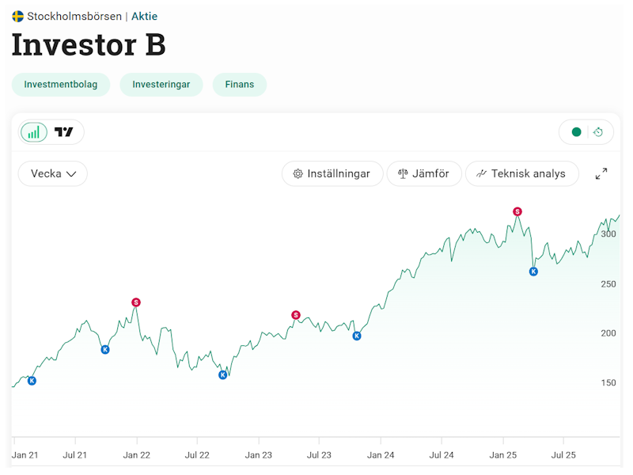

## Vad du kommer lära dig
- Varför timing är svårt
- Vad forskningen säger
- Ett bättre alternativ

## Kärnidén
I teorin är det enkelt. Köp när kursen är låg och sälj på topparna. 
 
I praktiken styrs marknaden av psykologi, inte logik.

De flesta köper när det känns tryggt – och säljer när det gör ont.

## Exempel
**Börsfall:**

- Media skriker kris!
- Sälj nu innan det blir ännu värre!
- Marknaden vänder upp snabbt utan förvarning

**Börseufori:**

- Media skriver om vilka aktier som gör dig rik
- Agda 83 år, blir framgångsrik "daytrader"
- Marknaden går som tåget och alla pratar aktier
- Börsen viker ner "över en natt"

## Vanliga misstag
- Att tro att man kan förutse marknaden
- Att agera på känsla istället för plan

## Nästa steg
Vill du bygga disciplin istället för tur?

[Prova att tajma marknaden i spelet här](/verktyg/market-timing/)
